# [📈 Live Status](https://demo.upptime.js.org): <!--live status--> **🟧 Partial outage**

This repository contains the open-source uptime monitor and status page for [Dmytro Bazeliuk](https://freelancer.pp.ua/), powered by [Upptime](https://github.com/upptime/upptime).

With [Upptime](https://upptime.js.org), you can get your own unlimited and free uptime monitor and status page, powered entirely by a GitHub repository. We use [Issues](https://github.com/dmytrobazeliuk-devops/upptime/issues) as incident reports, [Actions](https://github.com/dmytrobazeliuk-devops/upptime/actions) as uptime monitors, and [Pages](https://demo.upptime.js.org) for the status page.

<!--start: status pages-->
<!-- This summary is generated by Upptime (https://github.com/upptime/upptime) -->
<!-- Do not edit this manually, your changes will be overwritten -->
<!-- prettier-ignore -->
| URL | Status | History | Response Time | Uptime |
| --- | ------ | ------- | ------------- | ------ |
|  [2mind.us](https://2mind.us) | 🟩 Up | [2mind-us.yml](https://github.com/dmytrobazeliuk-devops/upptime/commits/HEAD/history/2mind-us.yml) | 

 226ms
     
 | 

<a href="https://dmytrobazeliuk-devops.github.io/upptime/history/2mind-us">100.00%</a>
    

|  [broomesignco.com](https://broomesignco.com) | 🟩 Up | [broomesignco-com.yml](https://github.com/dmytrobazeliuk-devops/upptime/commits/HEAD/history/broomesignco-com.yml) | 

 451ms
     
 | 

<a href="https://dmytrobazeliuk-devops.github.io/upptime/history/broomesignco-com">100.00%</a>
    

|  [charlottelogos.com](https://charlottelogos.com) | 🟩 Up | [charlottelogos-com.yml](https://github.com/dmytrobazeliuk-devops/upptime/commits/HEAD/history/charlottelogos-com.yml) | 

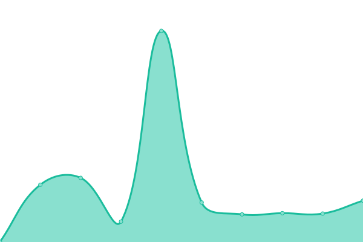 301ms
     
 | 

<a href="https://dmytrobazeliuk-devops.github.io/upptime/history/charlottelogos-com">100.00%</a>
    

|  [deadlinesigns.com](https://deadlinesigns.com) | 🟩 Up | [deadlinesigns-com.yml](https://github.com/dmytrobazeliuk-devops/upptime/commits/HEAD/history/deadlinesigns-com.yml) | 

 5565ms
     
 | 

<a href="https://dmytrobazeliuk-devops.github.io/upptime/history/deadlinesigns-com">100.00%</a>
    

|  [dentprodigy.com](https://dentprodigy.com) | 🟩 Up | [dentprodigy-com.yml](https://github.com/dmytrobazeliuk-devops/upptime/commits/HEAD/history/dentprodigy-com.yml) | 

 519ms
     
 | 

<a href="https://dmytrobazeliuk-devops.github.io/upptime/history/dentprodigy-com">100.00%</a>
    

|  [dev.file.supply](https://dev.file.supply) | 🟩 Up | [dev-file-supply.yml](https://github.com/dmytrobazeliuk-devops/upptime/commits/HEAD/history/dev-file-supply.yml) | 

 840ms
     
 | 

<a href="https://dmytrobazeliuk-devops.github.io/upptime/history/dev-file-supply">100.00%</a>
    

|  [email.dosminds.com](https://email.dosminds.com) | 🟩 Up | [email-dosminds-com.yml](https://github.com/dmytrobazeliuk-devops/upptime/commits/HEAD/history/email-dosminds-com.yml) | 

 265ms
     
 | 

<a href="https://dmytrobazeliuk-devops.github.io/upptime/history/email-dosminds-com">100.00%</a>
    

|  [file.supply](https://file.supply) | 🟩 Up | [file-supply.yml](https://github.com/dmytrobazeliuk-devops/upptime/commits/HEAD/history/file-supply.yml) | 

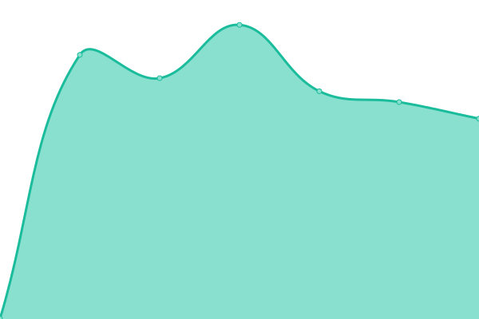 792ms
     
 | 

<a href="https://dmytrobazeliuk-devops.github.io/upptime/history/file-supply">100.00%</a>
    

|  [landing.twominds.company](https://landing.twominds.company) | 🟩 Up | [landing-twominds-company.yml](https://github.com/dmytrobazeliuk-devops/upptime/commits/HEAD/history/landing-twominds-company.yml) | 

 6281ms
     
 | 

<a href="https://dmytrobazeliuk-devops.github.io/upptime/history/landing-twominds-company">100.00%</a>
    

|  [onedrive.twominds.company](https://onedrive.twominds.company) | 🟩 Up | [onedrive-twominds-company.yml](https://github.com/dmytrobazeliuk-devops/upptime/commits/HEAD/history/onedrive-twominds-company.yml) | 

 741ms
     
 | 

<a href="https://dmytrobazeliuk-devops.github.io/upptime/history/onedrive-twominds-company">100.00%</a>
    

|  [reseller.deadlinesigns.com](https://reseller.deadlinesigns.com) | 🟩 Up | [reseller-deadlinesigns-com.yml](https://github.com/dmytrobazeliuk-devops/upptime/commits/HEAD/history/reseller-deadlinesigns-com.yml) | 

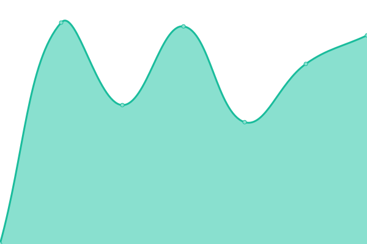 1182ms
     
 | 

<a href="https://dmytrobazeliuk-devops.github.io/upptime/history/reseller-deadlinesigns-com">100.00%</a>
    

|  [speedlight.biz](https://speedlight.biz) | 🟩 Up | [speedlight-biz.yml](https://github.com/dmytrobazeliuk-devops/upptime/commits/HEAD/history/speedlight-biz.yml) | 

 296ms
     
 | 

<a href="https://dmytrobazeliuk-devops.github.io/upptime/history/speedlight-biz">100.00%</a>
    

|  [twominds.company](https://twominds.company) | 🟩 Up | [twominds-company.yml](https://github.com/dmytrobazeliuk-devops/upptime/commits/HEAD/history/twominds-company.yml) | 

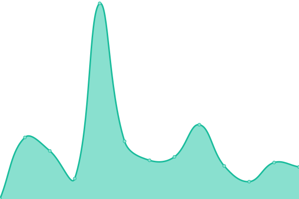 392ms
     
 | 

<a href="https://dmytrobazeliuk-devops.github.io/upptime/history/twominds-company">97.56%</a>
    

|  [twomindsgroup.com](https://twomindsgroup.com) | 🟩 Up | [twomindsgroup-com.yml](https://github.com/dmytrobazeliuk-devops/upptime/commits/HEAD/history/twomindsgroup-com.yml) | 

 711ms
     
 | 

<a href="https://dmytrobazeliuk-devops.github.io/upptime/history/twomindsgroup-com">100.00%</a>
    

|  [wefixyoursite.com](https://wefixyoursite.com) | 🟩 Up | [wefixyoursite-com.yml](https://github.com/dmytrobazeliuk-devops/upptime/commits/HEAD/history/wefixyoursite-com.yml) | 

 467ms
     
 | 

<a href="https://dmytrobazeliuk-devops.github.io/upptime/history/wefixyoursite-com">100.00%</a>
    

|  [yardcardprinter.com](https://yardcardprinter.com) | 🟩 Up | [yardcardprinter-com.yml](https://github.com/dmytrobazeliuk-devops/upptime/commits/HEAD/history/yardcardprinter-com.yml) | 

 3139ms
     
 | 

<a href="https://dmytrobazeliuk-devops.github.io/upptime/history/yardcardprinter-com">100.00%</a>
    

|  [yl.deadlinesigns.com](https://yl.deadlinesigns.com) | 🟩 Up | [yl-deadlinesigns-com.yml](https://github.com/dmytrobazeliuk-devops/upptime/commits/HEAD/history/yl-deadlinesigns-com.yml) | 

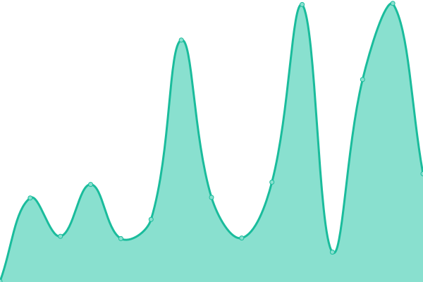 115ms
     
 | 

<a href="https://dmytrobazeliuk-devops.github.io/upptime/history/yl-deadlinesigns-com">100.00%</a>
    

|  [blog.it-srv.org](https://blog.it-srv.org) | 🟩 Up | [blog-it-srv-org.yml](https://github.com/dmytrobazeliuk-devops/upptime/commits/HEAD/history/blog-it-srv-org.yml) | 

 724ms
     
 | 

<a href="https://dmytrobazeliuk-devops.github.io/upptime/history/blog-it-srv-org">100.00%</a>
    

|  [c-welltech.com](https://c-welltech.com) | 🟥 Down | [c-welltech-com.yml](https://github.com/dmytrobazeliuk-devops/upptime/commits/HEAD/history/c-welltech-com.yml) | 

 2486ms
     
 | 

<a href="https://dmytrobazeliuk-devops.github.io/upptime/history/c-welltech-com">89.84%</a>
    

|  [finhyve.com](https://finhyve.com) | 🟥 Down | [finhyve-com.yml](https://github.com/dmytrobazeliuk-devops/upptime/commits/HEAD/history/finhyve-com.yml) | 

 3325ms
     
 | 

<a href="https://dmytrobazeliuk-devops.github.io/upptime/history/finhyve-com">93.84%</a>
    

|  [freelancer.pp.ua](https://freelancer.pp.ua) | 🟩 Up | [freelancer-pp-ua.yml](https://github.com/dmytrobazeliuk-devops/upptime/commits/HEAD/history/freelancer-pp-ua.yml) | 

 887ms
     
 | 

<a href="https://dmytrobazeliuk-devops.github.io/upptime/history/freelancer-pp-ua">100.00%</a>
    

|  [geovibor.com](https://geovibor.com) | 🟩 Up | [geovibor-com.yml](https://github.com/dmytrobazeliuk-devops/upptime/commits/HEAD/history/geovibor-com.yml) | 

 131ms
     
 | 

<a href="https://dmytrobazeliuk-devops.github.io/upptime/history/geovibor-com">100.00%</a>
    

|  [geomagazin.in.ua](https://geomagazin.in.ua) | 🟥 Down | [geomagazin-in-ua.yml](https://github.com/dmytrobazeliuk-devops/upptime/commits/HEAD/history/geomagazin-in-ua.yml) | 

 936ms
     
 | 

<a href="https://dmytrobazeliuk-devops.github.io/upptime/history/geomagazin-in-ua">93.86%</a>
    

|  [ghostops.chat](https://ghostops.chat) | 🟥 Down | [ghostops-chat.yml](https://github.com/dmytrobazeliuk-devops/upptime/commits/HEAD/history/ghostops-chat.yml) | 

 3320ms
     
 | 

<a href="https://dmytrobazeliuk-devops.github.io/upptime/history/ghostops-chat">92.09%</a>
    

|  [greenwallet.me](https://greenwallet.me) | 🟥 Down | [greenwallet-me.yml](https://github.com/dmytrobazeliuk-devops/upptime/commits/HEAD/history/greenwallet-me.yml) | 

 2024ms
     
 | 

<a href="https://dmytrobazeliuk-devops.github.io/upptime/history/greenwallet-me">93.17%</a>
    

|  [infotech-business-solutions.com](https://infotech-business-solutions.com) | 🟥 Down | [infotech-business-solutions-com.yml](https://github.com/dmytrobazeliuk-devops/upptime/commits/HEAD/history/infotech-business-solutions-com.yml) | 

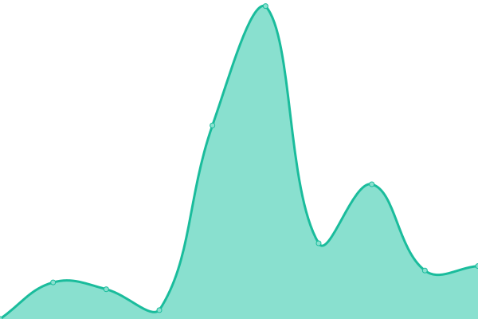 629ms
     
 | 

<a href="https://dmytrobazeliuk-devops.github.io/upptime/history/infotech-business-solutions-com">93.90%</a>
    

|  [insuranca.me](https://insuranca.me) | 🟥 Down | [insuranca-me.yml](https://github.com/dmytrobazeliuk-devops/upptime/commits/HEAD/history/insuranca-me.yml) | 

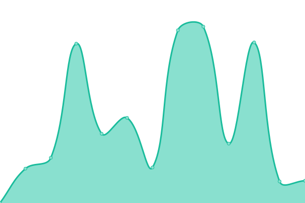 4900ms
     
 | 

<a href="https://dmytrobazeliuk-devops.github.io/upptime/history/insuranca-me">81.75%</a>
    

|  [obest-hk.com](https://obest-hk.com) | 🟥 Down | [obest-hk-com.yml](https://github.com/dmytrobazeliuk-devops/upptime/commits/HEAD/history/obest-hk-com.yml) | 

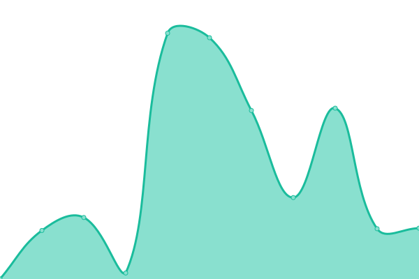 1941ms
     
 | 

<a href="https://dmytrobazeliuk-devops.github.io/upptime/history/obest-hk-com">93.78%</a>
    

|  [office2home.io](https://office2home.io) | 🟥 Down | [office2home-io.yml](https://github.com/dmytrobazeliuk-devops/upptime/commits/HEAD/history/office2home-io.yml) | 

 3025ms
     
 | 

<a href="https://dmytrobazeliuk-devops.github.io/upptime/history/office2home-io">93.81%</a>
    

|  [privpay.app](https://privpay.app) | 🟥 Down | [privpay-app.yml](https://github.com/dmytrobazeliuk-devops/upptime/commits/HEAD/history/privpay-app.yml) | 

 3035ms
     
 | 

<a href="https://dmytrobazeliuk-devops.github.io/upptime/history/privpay-app">93.83%</a>
    

|  [realswap.app](https://realswap.app) | 🟥 Down | [realswap-app.yml](https://github.com/dmytrobazeliuk-devops/upptime/commits/HEAD/history/realswap-app.yml) | 

 2983ms
     
 | 

<a href="https://dmytrobazeliuk-devops.github.io/upptime/history/realswap-app">93.85%</a>
    

|  [rosebo.com](https://rosebo.com) | 🟥 Down | [rosebo-com.yml](https://github.com/dmytrobazeliuk-devops/upptime/commits/HEAD/history/rosebo-com.yml) | 

 916ms
     
 | 

<a href="https://dmytrobazeliuk-devops.github.io/upptime/history/rosebo-com">93.88%</a>
    

|  [stopphishing.us](https://stopphishing.us) | 🟥 Down | [stopphishing-us.yml](https://github.com/dmytrobazeliuk-devops/upptime/commits/HEAD/history/stopphishing-us.yml) | 

 2179ms
     
 | 

<a href="https://dmytrobazeliuk-devops.github.io/upptime/history/stopphishing-us">94.28%</a>
    

|  [storeloyalty.ai](https://storeloyalty.ai) | 🟥 Down | [storeloyalty-ai.yml](https://github.com/dmytrobazeliuk-devops/upptime/commits/HEAD/history/storeloyalty-ai.yml) | 

 2511ms
     
 | 

<a href="https://dmytrobazeliuk-devops.github.io/upptime/history/storeloyalty-ai">88.62%</a>
    

|  [storesafety.app](https://storesafety.app) | 🟩 Up | [storesafety-app.yml](https://github.com/dmytrobazeliuk-devops/upptime/commits/HEAD/history/storesafety-app.yml) | 

 4713ms
     
 | 

<a href="https://dmytrobazeliuk-devops.github.io/upptime/history/storesafety-app">94.33%</a>
    

|  [thecruncher.io](https://thecruncher.io) | 🟩 Up | [thecruncher-io.yml](https://github.com/dmytrobazeliuk-devops/upptime/commits/HEAD/history/thecruncher-io.yml) | 

 4670ms
     
 | 

<a href="https://dmytrobazeliuk-devops.github.io/upptime/history/thecruncher-io">100.00%</a>
    

|  [ushare.social](https://ushare.social) | 🟥 Down | [ushare-social.yml](https://github.com/dmytrobazeliuk-devops/upptime/commits/HEAD/history/ushare-social.yml) | 

 4021ms
     
 | 

<a href="https://dmytrobazeliuk-devops.github.io/upptime/history/ushare-social">96.44%</a>
    

|  [wagewings.ai](https://wagewings.ai) | 🟩 Up | [wagewings-ai.yml](https://github.com/dmytrobazeliuk-devops/upptime/commits/HEAD/history/wagewings-ai.yml) | 

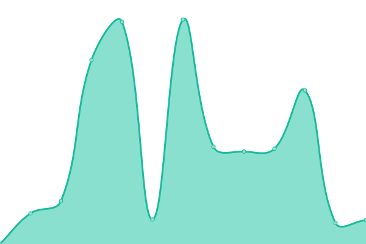 4523ms
     
 | 

<a href="https://dmytrobazeliuk-devops.github.io/upptime/history/wagewings-ai">100.00%</a>
    

|  [welove.tips](https://welove.tips) | 🟩 Up | [welove-tips.yml](https://github.com/dmytrobazeliuk-devops/upptime/commits/HEAD/history/welove-tips.yml) | 

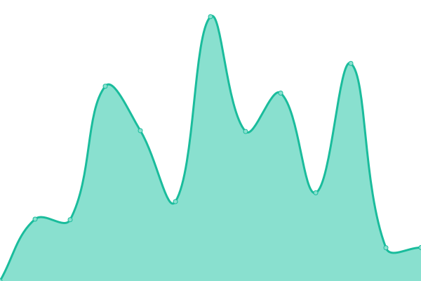 5479ms
     
 | 

<a href="https://dmytrobazeliuk-devops.github.io/upptime/history/welove-tips">100.00%</a>
    

|  [weprevent.net](https://weprevent.net) | 🟩 Up | [weprevent-net.yml](https://github.com/dmytrobazeliuk-devops/upptime/commits/HEAD/history/weprevent-net.yml) | 

 4220ms
     
 | 

<a href="https://dmytrobazeliuk-devops.github.io/upptime/history/weprevent-net">100.00%</a>
    

|  [wingwage.com](https://wingwage.com) | 🟩 Up | [wingwage-com.yml](https://github.com/dmytrobazeliuk-devops/upptime/commits/HEAD/history/wingwage-com.yml) | 

 4512ms
     
 | 

<a href="https://dmytrobazeliuk-devops.github.io/upptime/history/wingwage-com">100.00%</a>
    

|  [api.api.x-sensor.network](https://api.api.x-sensor.network) | 🟥 Down | [api-api-x-sensor-network.yml](https://github.com/dmytrobazeliuk-devops/upptime/commits/HEAD/history/api-api-x-sensor-network.yml) | 

 1072ms
     
 | 

<a href="https://dmytrobazeliuk-devops.github.io/upptime/history/api-api-x-sensor-network">0.02%</a>
    

|  [api.x-sensor.network](https://api.x-sensor.network) | 🟥 Down | [api-x-sensor-network.yml](https://github.com/dmytrobazeliuk-devops/upptime/commits/HEAD/history/api-x-sensor-network.yml) | 

 802ms
     
 | 

<a href="https://dmytrobazeliuk-devops.github.io/upptime/history/api-x-sensor-network">0.01%</a>
    

|  [birdi.ai](https://birdi.ai) | 🟩 Up | [birdi-ai.yml](https://github.com/dmytrobazeliuk-devops/upptime/commits/HEAD/history/birdi-ai.yml) | 

 349ms
     
 | 

<a href="https://dmytrobazeliuk-devops.github.io/upptime/history/birdi-ai">100.00%</a>
    

|  [dehyper.com](https://dehyper.com) | 🟩 Up | [dehyper-com.yml](https://github.com/dmytrobazeliuk-devops/upptime/commits/HEAD/history/dehyper-com.yml) | 

 502ms
     
 | 

<a href="https://dmytrobazeliuk-devops.github.io/upptime/history/dehyper-com">100.00%</a>
    

|  [dev.x-sensor.net](https://dev.x-sensor.net) | 🟩 Up | [dev-x-sensor-net.yml](https://github.com/dmytrobazeliuk-devops/upptime/commits/HEAD/history/dev-x-sensor-net.yml) | 

 4100ms
     
 | 

<a href="https://dmytrobazeliuk-devops.github.io/upptime/history/dev-x-sensor-net">100.00%</a>
    

|  [early-profits.com](https://early-profits.com) | 🟩 Up | [early-profits-com.yml](https://github.com/dmytrobazeliuk-devops/upptime/commits/HEAD/history/early-profits-com.yml) | 

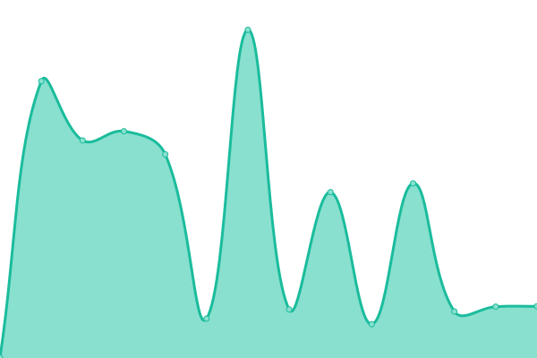 622ms
     
 | 

<a href="https://dmytrobazeliuk-devops.github.io/upptime/history/early-profits-com">100.00%</a>
    

|  [eviguard.app](https://eviguard.app) | 🟩 Up | [eviguard-app.yml](https://github.com/dmytrobazeliuk-devops/upptime/commits/HEAD/history/eviguard-app.yml) | 

 2007ms
     
 | 

<a href="https://dmytrobazeliuk-devops.github.io/upptime/history/eviguard-app">100.00%</a>
    

|  [extreme-smartphone.com](https://extreme-smartphone.com) | 🟩 Up | [extreme-smartphone-com.yml](https://github.com/dmytrobazeliuk-devops/upptime/commits/HEAD/history/extreme-smartphone-com.yml) | 

 1970ms
     
 | 

<a href="https://dmytrobazeliuk-devops.github.io/upptime/history/extreme-smartphone-com">100.00%</a>
    

|  [Flodder.nl](https://flodder.nl) | 🟩 Up | [flodder-nl.yml](https://github.com/dmytrobazeliuk-devops/upptime/commits/HEAD/history/flodder-nl.yml) | 

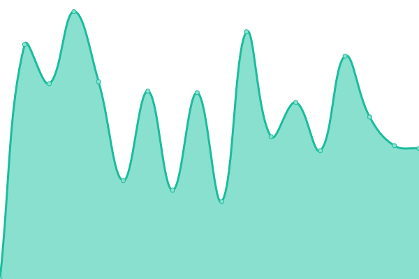 1541ms
     
 | 

<a href="https://dmytrobazeliuk-devops.github.io/upptime/history/flodder-nl">100.00%</a>
    

|  [hacked.nl](https://hacked.nl) | 🟥 Down | [hacked-nl.yml](https://github.com/dmytrobazeliuk-devops/upptime/commits/HEAD/history/hacked-nl.yml) | 

 0ms
     
 | 

<a href="https://dmytrobazeliuk-devops.github.io/upptime/history/hacked-nl">0.35%</a>
    

|  [jayjay-izaak.com](https://jayjay-izaak.com) | 🟩 Up | [jayjay-izaak-com.yml](https://github.com/dmytrobazeliuk-devops/upptime/commits/HEAD/history/jayjay-izaak-com.yml) | 

 1490ms
     
 | 

<a href="https://dmytrobazeliuk-devops.github.io/upptime/history/jayjay-izaak-com">100.00%</a>
    

|  [landfighter.eu](https://landfighter.eu) | 🟩 Up | [landfighter-eu.yml](https://github.com/dmytrobazeliuk-devops/upptime/commits/HEAD/history/landfighter-eu.yml) | 

 11935ms
     
 | 

<a href="https://dmytrobazeliuk-devops.github.io/upptime/history/landfighter-eu">100.00%</a>
    

|  [mailxsurvey.com](https://mailxsurvey.com) | 🟩 Up | [mailxsurvey-com.yml](https://github.com/dmytrobazeliuk-devops/upptime/commits/HEAD/history/mailxsurvey-com.yml) | 

 1982ms
     
 | 

<a href="https://dmytrobazeliuk-devops.github.io/upptime/history/mailxsurvey-com">100.00%</a>
    

|  [meyersmediagroup.com](https://meyersmediagroup.com) | 🟩 Up | [meyersmediagroup-com.yml](https://github.com/dmytrobazeliuk-devops/upptime/commits/HEAD/history/meyersmediagroup-com.yml) | 

 878ms
     
 | 

<a href="https://dmytrobazeliuk-devops.github.io/upptime/history/meyersmediagroup-com">100.00%</a>
    

|  [meyersmediagroup.eu](https://meyersmediagroup.eu) | 🟩 Up | [meyersmediagroup-eu.yml](https://github.com/dmytrobazeliuk-devops/upptime/commits/HEAD/history/meyersmediagroup-eu.yml) | 

 11920ms
     
 | 

<a href="https://dmytrobazeliuk-devops.github.io/upptime/history/meyersmediagroup-eu">100.00%</a>
    

|  [new.x-systems.com](https://new.x-systems.com) | 🟥 Down | [new-x-systems-com.yml](https://github.com/dmytrobazeliuk-devops/upptime/commits/HEAD/history/new-x-systems-com.yml) | 

 0ms
     
 | 

<a href="https://dmytrobazeliuk-devops.github.io/upptime/history/new-x-systems-com">0.03%</a>
    

|  [nextwave.tools](https://nextwave.tools) | 🟩 Up | [nextwave-tools.yml](https://github.com/dmytrobazeliuk-devops/upptime/commits/HEAD/history/nextwave-tools.yml) | 

 5076ms
     
 | 

<a href="https://dmytrobazeliuk-devops.github.io/upptime/history/nextwave-tools">100.00%</a>
    

|  [ochama.io](https://ochama.io) | 🟥 Down | [ochama-io.yml](https://github.com/dmytrobazeliuk-devops/upptime/commits/HEAD/history/ochama-io.yml) | 

 0ms
     
 | 

<a href="https://dmytrobazeliuk-devops.github.io/upptime/history/ochama-io">0.01%</a>
    

|  [secure-os.com](https://secure-os.com) | 🟥 Down | [secure-os-com.yml](https://github.com/dmytrobazeliuk-devops/upptime/commits/HEAD/history/secure-os-com.yml) | 

 833ms
     
 | 

<a href="https://dmytrobazeliuk-devops.github.io/upptime/history/secure-os-com">0.00%</a>
    

|  [secureteaming.com](https://secureteaming.com) | 🟥 Down | [secureteaming-com.yml](https://github.com/dmytrobazeliuk-devops/upptime/commits/HEAD/history/secureteaming-com.yml) | 

 0ms
     
 | 

<a href="https://dmytrobazeliuk-devops.github.io/upptime/history/secureteaming-com">0.19%</a>
    

|  [sendy.x-systems.com](https://sendy.x-systems.com) | 🟥 Down | [sendy-x-systems-com.yml](https://github.com/dmytrobazeliuk-devops/upptime/commits/HEAD/history/sendy-x-systems-com.yml) | 

 0ms
     
 | 

<a href="https://dmytrobazeliuk-devops.github.io/upptime/history/sendy-x-systems-com">0.00%</a>
    

|  [Sensor4More.com](https://sensor4more.com) | 🟩 Up | [sensor4-more-com.yml](https://github.com/dmytrobazeliuk-devops/upptime/commits/HEAD/history/sensor4-more-com.yml) | 

 2565ms
     
 | 

<a href="https://dmytrobazeliuk-devops.github.io/upptime/history/sensor4-more-com">100.00%</a>
    

|  [suitecrm.x-systems.com](https://suitecrm.x-systems.com) | 🟥 Down | [suitecrm-x-systems-com.yml](https://github.com/dmytrobazeliuk-devops/upptime/commits/HEAD/history/suitecrm-x-systems-com.yml) | 

 0ms
     
 | 

<a href="https://dmytrobazeliuk-devops.github.io/upptime/history/suitecrm-x-systems-com">0.00%</a>
    

|  [tester.x-surveillance.com](https://tester.x-surveillance.com) | 🟥 Down | [tester-x-surveillance-com.yml](https://github.com/dmytrobazeliuk-devops/upptime/commits/HEAD/history/tester-x-surveillance-com.yml) | 

 685ms
     
 | 

<a href="https://dmytrobazeliuk-devops.github.io/upptime/history/tester-x-surveillance-com">0.01%</a>
    

|  [tradeparc.com](https://tradeparc.com) | 🟩 Up | [tradeparc-com.yml](https://github.com/dmytrobazeliuk-devops/upptime/commits/HEAD/history/tradeparc-com.yml) | 

 983ms
     
 | 

<a href="https://dmytrobazeliuk-devops.github.io/upptime/history/tradeparc-com">100.00%</a>
    

|  [twominds.company](https://twominds.company) | 🟩 Up | [twominds-company.yml](https://github.com/dmytrobazeliuk-devops/upptime/commits/HEAD/history/twominds-company.yml) | 

 392ms
     
 | 

<a href="https://dmytrobazeliuk-devops.github.io/upptime/history/twominds-company">97.56%</a>
    

|  [twomindsgroup.com](https://twomindsgroup.com) | 🟩 Up | [twomindsgroup-com.yml](https://github.com/dmytrobazeliuk-devops/upptime/commits/HEAD/history/twomindsgroup-com.yml) | 

 711ms
     
 | 

<a href="https://dmytrobazeliuk-devops.github.io/upptime/history/twomindsgroup-com">100.00%</a>
    

|  [wefixyoursite.com](https://wefixyoursite.com) | 🟩 Up | [wefixyoursite-com.yml](https://github.com/dmytrobazeliuk-devops/upptime/commits/HEAD/history/wefixyoursite-com.yml) | 

 467ms
     
 | 

<a href="https://dmytrobazeliuk-devops.github.io/upptime/history/wefixyoursite-com">100.00%</a>
    

|  [web.x-surveillance.com](https://web.x-surveillance.com) | 🟩 Up | [web-x-surveillance-com.yml](https://github.com/dmytrobazeliuk-devops/upptime/commits/HEAD/history/web-x-surveillance-com.yml) | 

 1713ms
     
 | 

<a href="https://dmytrobazeliuk-devops.github.io/upptime/history/web-x-surveillance-com">100.00%</a>
    

|  [web.x-systems.com](https://web.x-systems.com) | 🟥 Down | [web-x-systems-com.yml](https://github.com/dmytrobazeliuk-devops/upptime/commits/HEAD/history/web-x-systems-com.yml) | 

 0ms
     
 | 

<a href="https://dmytrobazeliuk-devops.github.io/upptime/history/web-x-systems-com">0.02%</a>
    

|  [x-alert.com](https://x-alert.com) | 🟩 Up | [x-alert-com.yml](https://github.com/dmytrobazeliuk-devops/upptime/commits/HEAD/history/x-alert-com.yml) | 

 4242ms
     
 | 

<a href="https://dmytrobazeliuk-devops.github.io/upptime/history/x-alert-com">100.00%</a>
    

|  [x-alert.eu](https://x-alert.eu) | 🟥 Down | [x-alert-eu.yml](https://github.com/dmytrobazeliuk-devops/upptime/commits/HEAD/history/x-alert-eu.yml) | 

 0ms
     
 | 

<a href="https://dmytrobazeliuk-devops.github.io/upptime/history/x-alert-eu">0.00%</a>
    

|  [x-alert.support](https://x-alert.support) | 🟩 Up | [x-alert-support.yml](https://github.com/dmytrobazeliuk-devops/upptime/commits/HEAD/history/x-alert-support.yml) | 

 2448ms
     
 | 

<a href="https://dmytrobazeliuk-devops.github.io/upptime/history/x-alert-support">100.00%</a>
    

|  [x-aware.com](https://x-aware.com) | 🟩 Up | [x-aware-com.yml](https://github.com/dmytrobazeliuk-devops/upptime/commits/HEAD/history/x-aware-com.yml) | 

 4790ms
     
 | 

<a href="https://dmytrobazeliuk-devops.github.io/upptime/history/x-aware-com">100.00%</a>
    

|  [x-enterprise.eu](https://x-enterprise.eu) | 🟩 Up | [x-enterprise-eu.yml](https://github.com/dmytrobazeliuk-devops/upptime/commits/HEAD/history/x-enterprise-eu.yml) | 

 5526ms
     
 | 

<a href="https://dmytrobazeliuk-devops.github.io/upptime/history/x-enterprise-eu">100.00%</a>
    

|  [x-enterprise.org](https://x-enterprise.org) | 🟩 Up | [x-enterprise-org.yml](https://github.com/dmytrobazeliuk-devops/upptime/commits/HEAD/history/x-enterprise-org.yml) | 

 2127ms
     
 | 

<a href="https://dmytrobazeliuk-devops.github.io/upptime/history/x-enterprise-org">100.00%</a>
    

|  [x-platform.io](https://x-platform.io) | 🟩 Up | [x-platform-io.yml](https://github.com/dmytrobazeliuk-devops/upptime/commits/HEAD/history/x-platform-io.yml) | 

 3045ms
     
 | 

<a href="https://dmytrobazeliuk-devops.github.io/upptime/history/x-platform-io">100.00%</a>
    

|  [x-protected.com](https://x-protected.com) | 🟩 Up | [x-protected-com.yml](https://github.com/dmytrobazeliuk-devops/upptime/commits/HEAD/history/x-protected-com.yml) | 

 2962ms
     
 | 

<a href="https://dmytrobazeliuk-devops.github.io/upptime/history/x-protected-com">100.00%</a>
    

|  [x-secure.systems](https://x-secure.systems) | 🟩 Up | [x-secure-systems.yml](https://github.com/dmytrobazeliuk-devops/upptime/commits/HEAD/history/x-secure-systems.yml) | 

 8850ms
     
 | 

<a href="https://dmytrobazeliuk-devops.github.io/upptime/history/x-secure-systems">100.00%</a>
    

|  [x-sensor.net](https://x-sensor.net) | 🟩 Up | [x-sensor-net.yml](https://github.com/dmytrobazeliuk-devops/upptime/commits/HEAD/history/x-sensor-net.yml) | 

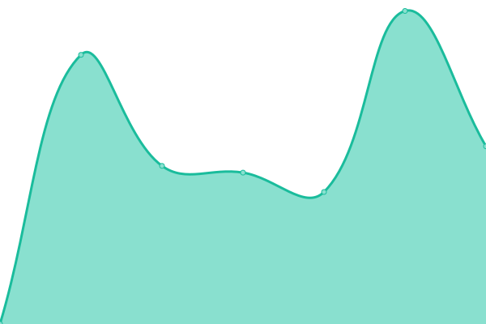 2638ms
     
 | 

<a href="https://dmytrobazeliuk-devops.github.io/upptime/history/x-sensor-net">100.00%</a>
    

|  [x-sensor.network](https://x-sensor.network) | 🟩 Up | [x-sensor-network.yml](https://github.com/dmytrobazeliuk-devops/upptime/commits/HEAD/history/x-sensor-network.yml) | 

 2910ms
     
 | 

<a href="https://dmytrobazeliuk-devops.github.io/upptime/history/x-sensor-network">100.00%</a>
    

|  [x-sensor.support](https://x-sensor.support) | 🟩 Up | [x-sensor-support.yml](https://github.com/dmytrobazeliuk-devops/upptime/commits/HEAD/history/x-sensor-support.yml) | 

 3953ms
     
 | 

<a href="https://dmytrobazeliuk-devops.github.io/upptime/history/x-sensor-support">100.00%</a>
    

|  [x-support.online](https://x-support.online) | 🟩 Up | [x-support-online.yml](https://github.com/dmytrobazeliuk-devops/upptime/commits/HEAD/history/x-support-online.yml) | 

 2167ms
     
 | 

<a href="https://dmytrobazeliuk-devops.github.io/upptime/history/x-support-online">100.00%</a>
    

|  [x-surveillance.com](https://x-surveillance.com) | 🟩 Up | [x-surveillance-com.yml](https://github.com/dmytrobazeliuk-devops/upptime/commits/HEAD/history/x-surveillance-com.yml) | 

 786ms
     
 | 

<a href="https://dmytrobazeliuk-devops.github.io/upptime/history/x-surveillance-com">100.00%</a>
    

|  [x-syst.eu](https://x-syst.eu) | 🟩 Up | [x-syst-eu.yml](https://github.com/dmytrobazeliuk-devops/upptime/commits/HEAD/history/x-syst-eu.yml) | 

 4879ms
     
 | 

<a href="https://dmytrobazeliuk-devops.github.io/upptime/history/x-syst-eu">100.00%</a>
    

|  [x-systems.com](https://x-systems.com) | 🟩 Up | [x-systems-com.yml](https://github.com/dmytrobazeliuk-devops/upptime/commits/HEAD/history/x-systems-com.yml) | 

 745ms
     
 | 

<a href="https://dmytrobazeliuk-devops.github.io/upptime/history/x-systems-com">100.00%</a>
    

|  [x-systems.net](https://x-systems.net) | 🟩 Up | [x-systems-net.yml](https://github.com/dmytrobazeliuk-devops/upptime/commits/HEAD/history/x-systems-net.yml) | 

 5427ms
     
 | 

<a href="https://dmytrobazeliuk-devops.github.io/upptime/history/x-systems-net">100.00%</a>
    

|  [xmapsystems.com](https://xmapsystems.com) | 🟩 Up | [xmapsystems-com.yml](https://github.com/dmytrobazeliuk-devops/upptime/commits/HEAD/history/xmapsystems-com.yml) | 

 1989ms
     
 | 

<a href="https://dmytrobazeliuk-devops.github.io/upptime/history/xmapsystems-com">100.00%</a>
    

|  [xsystems-store.com](https://xsystems-store.com) | 🟩 Up | [xsystems-store-com.yml](https://github.com/dmytrobazeliuk-devops/upptime/commits/HEAD/history/xsystems-store-com.yml) | 

 4510ms
     
 | 

<a href="https://dmytrobazeliuk-devops.github.io/upptime/history/xsystems-store-com">100.00%</a>
    

|  [live.x-alert.network](https://live.x-alert.network/) | 🟩 Up | [live-x-alert-network.yml](https://github.com/dmytrobazeliuk-devops/upptime/commits/HEAD/history/live-x-alert-network.yml) | 

 850ms
     
 | 

<a href="https://dmytrobazeliuk-devops.github.io/upptime/history/live-x-alert-network">100.00%</a>
    

|  [dashboard.x-platform.network](https://dashboard.x-platform.network/) | 🟩 Up | [dashboard-x-platform-network.yml](https://github.com/dmytrobazeliuk-devops/upptime/commits/HEAD/history/dashboard-x-platform-network.yml) | 

 726ms
     
 | 

<a href="https://dmytrobazeliuk-devops.github.io/upptime/history/dashboard-x-platform-network">100.00%</a>
    

|  [webmail.x-systems.com](https://webmail.x-systems.com/) | 🟩 Up | [webmail-x-systems-com.yml](https://github.com/dmytrobazeliuk-devops/upptime/commits/HEAD/history/webmail-x-systems-com.yml) | 

 658ms
     
 | 

<a href="https://dmytrobazeliuk-devops.github.io/upptime/history/webmail-x-systems-com">100.00%</a>
    

<!--end: status pages-->

[**Visit our status website →**](https://demo.upptime.js.org)

## 📄 License

- Powered by: [Upptime](https://github.com/upptime/upptime)
- Code: [MIT](./LICENSE) © [Anand Chowdhary](https://anandchowdhary.com), supported by [Pabio](https://pabio.com)
- Data in the `./history` directory: [Open Database License](https://opendatacommons.org/licenses/odbl/1-0/)
